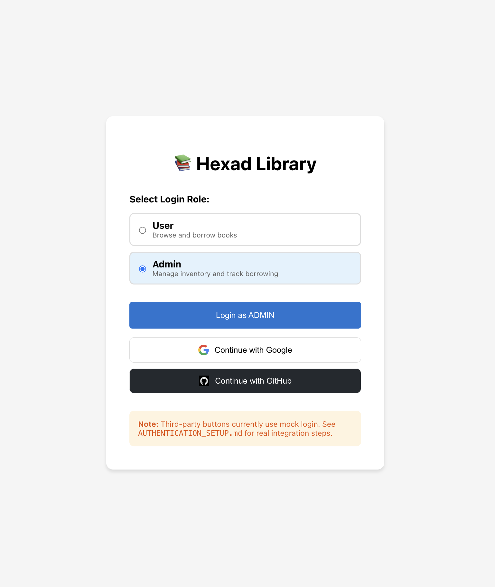

# Hexad Library - Management System

A robust library management system built with React and TypeScript. This application allows users to browse, borrow, and return books while providing administrators with powerful tools for inventory management and borrowing tracking.

## � Screenshots

### Login Page


### User Dashboard


### Admin Dashboard


## �🚀 Core Features

### User Experience
- **Book Browsing**: Explore a wide collection of books with real-time availability status.
- **Borrowing System**: Simple one-click borrowing with an enforced limit of **2 books per user**.
- **Return System**: Easy return process for borrowed books with a dedicated "My Borrowed Books" section.
- **Stock Indicators**: Clear visual cues for stock levels, including "Out of Stock" badges and color-coded availability.
- **Responsive Design**: A clean, intuitive interface that works across different screen sizes.

### Admin Privileges
- **Inventory Management**: Add new books to the library and monitor total stock levels.
- **Borrower Tracking**: Detailed view of who has borrowed which books, including borrow dates and due dates.
- **Stock Monitoring**: Real-time statistics on total, available, and borrowed books.
- **Overdue Alerts**: Visual indicators for books that have passed their 14-day loan period.
- **Full Access**: Admins retain all standard user functionalities in addition to administrative controls.

### Security & Logic
- **Role-Based Access Control**: Secure routing for User and Admin dashboards.
- **Borrow Limit Enforcement**: Prevents users from exceeding the 2-book maximum.
- **Over-Return Prevention**: Validates returns to ensure stock integrity.
- **Mock API Service**: Fully simulated backend with realistic delays and error handling.

---

## 📁 Project Structure

```
src/
├── app/
│   ├── routes.tsx           # Routing configuration
│   ├── LoginPage.tsx        # Role-based login
│   └── Navigation.tsx       # Global navigation bar
├── auth/
│   ├── AuthContext.tsx      # Authentication state
│   └── ProtectedRoute.tsx   # Access control logic
├── books/
│   ├── components/          # BookCard and BookList components
│   ├── hooks/               # useBooks custom hook
│   └── types.ts             # Book and BorrowRecord definitions
├── admin/
│   ├── AdminDashboard.tsx   # Admin stats and tracking
│   └── AddBookForm.tsx      # Inventory management
├── user/
│   └── UserDashboard.tsx    # User-specific view
├── mock/
│   ├── mockData.ts          # Initial library data
│   └── mockApi.ts           # Simulated backend logic
├── shared/
│   └── components/          # Reusable UI components (Button, Error)
└── tests/
    └── borrowReturn.test.ts # Automated test suite
```

---

## �️ Technologies Used

- **React**: UI Library
- **TypeScript**: Static typing for reliability
- **React Router**: Navigation and routing
- **React Hooks**: State and lifecycle management
- **Jest**: Unit and integration testing

---

## 💻 Getting Started

### Prerequisites
- Node.js (v14 or higher)
- npm

### Installation

1. Clone the repository:
   ```bash
   git clone https://github.com/Swatinavgurukul/hexad-library.git
   cd hexad-library
   ```

2. Install dependencies:
   ```bash
   npm install
   ```

3. Start the development server:
   ```bash
   npm start
   ```

The application will be available at `http://localhost:3000`.

---

## 🧪 Testing

The project includes a comprehensive test suite covering all core business logic.

Run tests with:
```bash
npm test
```

The tests verify:
- Borrowing limits (max 2 books)
- Stock management (preventing negative stock)
- Return validation (preventing over-returns)
- Admin inventory operations

---

## � Authentication Note

The current version uses a mock authentication system for demonstration. For information on integrating real Google or GitHub OAuth, please refer to **[AUTHENTICATION_SETUP.md](AUTHENTICATION_SETUP.md)**.

---

